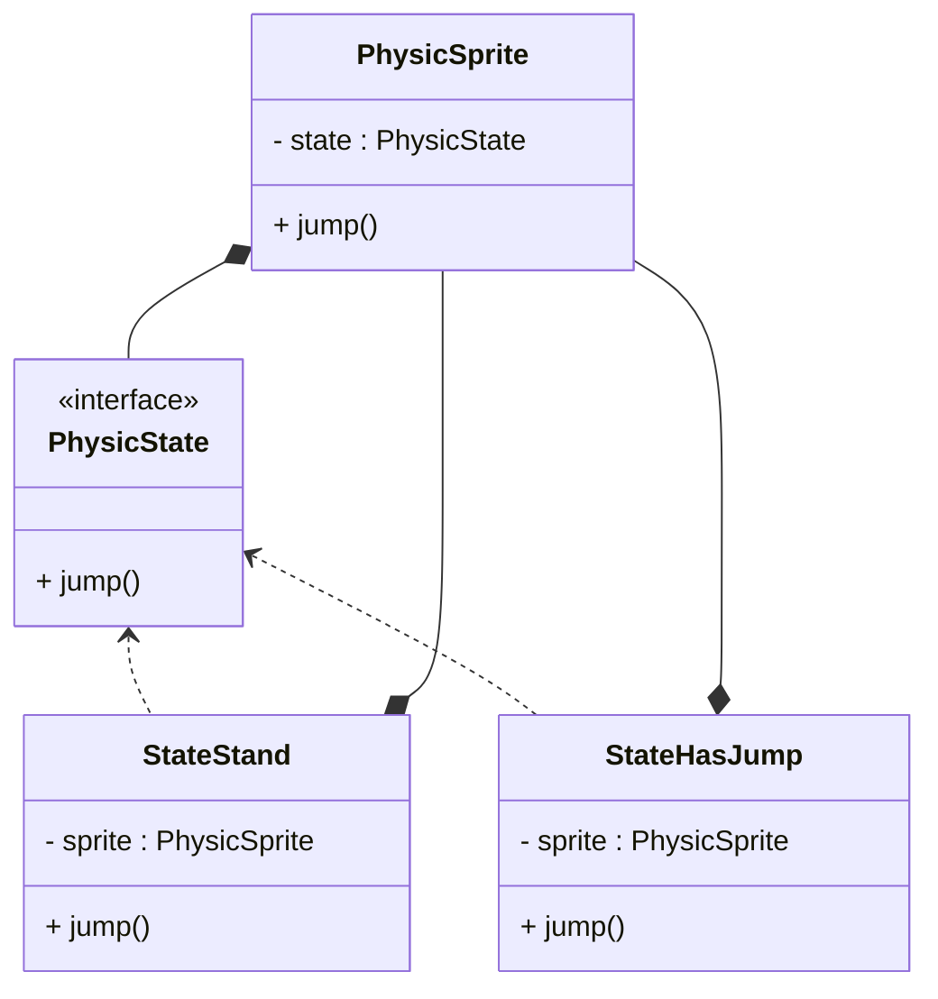
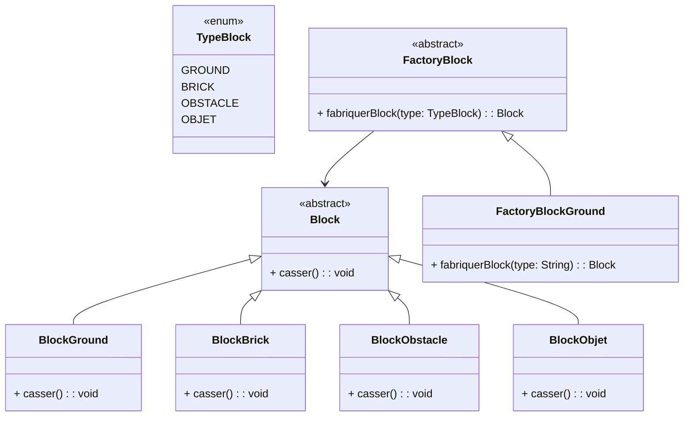

# UML

## State on the PhysicSprite class (Maio, monsters, ...)

```mermaid
    classDiagram

    class PhysicSprite {
        - state : PhysicState
        + jump()
    }

    class PhysicState {
        <<interface>>
        + jump()
    }

    class StateStand {
        - sprite : PhysicSprite
        + jump()
    }

    class StateHasJump {
        - sprite : PhysicSprite
        + jump()
    }

    PhysicSprite *-- PhysicState
    PhysicState <.. StateStand
    PhysicState <.. StateHasJump
    PhysicSprite --* StateStand
    PhysicSprite --* StateHasJump
```

## Factory
3 factories were implemented :
- 1 for the blocks
- 1 for the tiles
- 1 for the monsters

```mermaid
classDiagram
    class TypeBlock {
        <<enum>>
        GROUND
        BRICK
        OBSTACLE
        OBJET
    }

    class Block {
        <<abstract>>
        + casser(): void
    }

    class FactoryBlock {
        <<abstract>>
        + fabriquerBlock(type: TypeBlock): Block
    }

    class BlockGround {
        + casser(): void
    }

    class BlockBrick {
        + casser(): void
    }

    class BlockObstacle {
        + casser(): void
    }

    class BlockObjet {
        + casser(): void
    }

    class FactoryBlockGround {
        + fabriquerBlock(type: String): Block
    }

    Block <|-- BlockGround
    Block <|-- BlockBrick
    Block <|-- BlockObstacle
    Block <|-- BlockObjet
    FactoryBlock <|-- FactoryBlockGround
    FactoryBlock --> Block
```